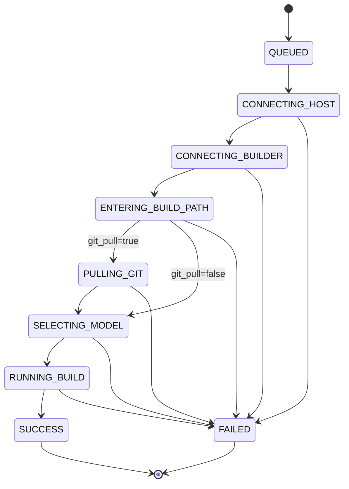

<div align="center">

# 🚀 Remote Build Automation System

<br>

**2-단계 SSH 원격 빌드를 자동화하는 CLI + FastAPI 서버 + Web UI**

[](https://www.python.org/)
[](https://fastapi.tiangolo.com/)
[](#-테스트)
[](https://playwright.dev/)
[](#-사전-요구사항)
[](#️-로드맵)
[](#)

</div>

---

Mac/Windows 터미널에서 수행하던 2단계 SSH 기반 원격 빌드 절차 (`user@host → builder@host:3021 → cd <build path> → ./select/<model> → ./build.sh [-c]`) 를 자동화한다. **CLI 1회 성공**·**3개 도메인 (System / APK / ADB)**·**40+ FastAPI 엔드포인트 + 3 WebSocket 스트림**·**APK debug↔release 변형 + 4단계 keystore 자동 탐지**·**드래그/↑↓ 카드 순서 변경**·**SSE 실시간 로그 스트리밍**·**Virtual-scroll Web UI**·**로컬 LLM 챗봇 (자연어 빌드 명령 + 상태/실패 분석)** 을 제공해 Web/App/Paperclip 이 공통으로 사용할 수 있다.

## 📑 목차

- [✨ 주요 기능](#-주요-기능)
- [🆕 최근 변경](#-최근-변경-2026-05)
- [⚡ 빠른 시작](#-빠른-시작)
- [🖥️ Web UI 사용법](#️-web-ui-사용법)
- [🏗️ 아키텍처](#️-아키텍처)
- [🎯 API 엔드포인트](#-api-엔드포인트)
- [⚙️ 환경변수](#️-환경변수)
- [🔁 빌드 상태 머신](#-빌드-상태-머신)
- [🧪 테스트](#-테스트)
- [📁 디렉터리 구조](#-디렉터리-구조)
- [📚 문서](#-문서)
- [🗺️ 로드맵](#️-로드맵)

## ✨ 주요 기능

| | |
|---|---|
| 🔐 **2단계 SSH 자동 로그인** | `pexpect` 기반 host → builder 순차 인증 + 프롬프트 감지 |
| 🎯 **다중 타겟 병렬 빌드** | `targets.json` 으로 여러 `build_path` 등록, 경로별 파일락으로 직렬화, 서로 다른 경로는 동시 실행 |
| 🎚️ **타겟별 model 선택** | 각 타겟이 `<build_path>/select/*.sh` 중 하나를 `model` 필드로 저장. Web UI Add 모달이 server-side listing 으로 dropdown 을 채워 강제 선택, 빌드 직전 `./select/<model>` 자동 호출 |
| 📡 **SSE 실시간 로그 스트리밍** | 자동 재연결 (exp backoff 1s→30s), `Last-Event-ID`/`?offset=` resume, 100ms disconnect 감지 |
| 📊 **완결한 상태 머신** | `QUEUED → CONNECTING_* → ENTERING_BUILD_PATH → (PULLING_GIT) → SELECTING_MODEL → RUNNING_BUILD → SUCCESS/FAILED`, 27개 `BuildErrorCode` |
| 🎛️ **Job 라이프사이클 제어** | 재시도 버튼 (FAILED Job), 취소 버튼 (non-terminal · Job Detail 헤더 + Dashboard 카드 build 버튼이 진행 중일 때 "종료" 로 변신), 연결 테스트 (Target 모달) |
| 💾 **Job 영속성** | 메타데이터 JSON 스냅샷 + 재기동 시 진행중 job 을 `FAILED + SERVER_RESTARTED` 로 복원 |
| 🌐 **Web UI** | SVG 차트, Virtual-scroll 로그 뷰어, Command Palette (Cmd+K), 다크모드, Dashboard 사이드바 |
| 🤖 **로컬 LLM 챗봇 — 명령 & 상태 조회 통합** | 우측 패널의 챗봇 1개로 **자연어 빌드 명령** + **상태/실패 분석**을 모두 수행. LM Studio (`http://127.0.0.1:1337/v1`) 등 OpenAI 호환 로컬 LLM 직결 (백엔드 경유 X, 키 노출 0). 매 메시지가 먼저 JSON intent router 로 분류되어 `build` 면 검증된 타겟명만 `/build/start` 로 dispatch (verbatim guard — 모르는 이름은 chat 으로 강등), `chat` 이면 streaming 응답. 시스템 프롬프트가 매 호출마다 **현재 타겟 / APK 프로젝트 / 실행 중 빌드 / 최근 종료 5건 / 최근 실패 빌드 로그 30줄** 자동 주입 → "실패 원인 알려줘" 같은 요청에 실제 로그 인용 응답. 챗봇이 트리거한 빌드는 SUCCESS/FAILED 시 ✓/✗ + duration 알림 메시지 자동 푸시 |
| 🛡️ **Backpressure** | Thread pool 포화 시 즉시 `HTTP 503 QUEUE_FULL` (요청 stall 방지) |
| 🔒 **2-tier 인증** | `API_TOKEN` (read/빌드) + 선택적 `ADMIN_TOKEN` (Target CRUD 분리) |
| 🏥 **상세 Readiness probe** | `GET /health/ready` — job_store / log_dir / thread_pool / recent_builds subsystem 상태 |
| 🔁 **Hot-reload Targets** | `targets.json` 수기 편집을 5초 내 자동 반영, 진행 중 job 보호, 중복 name/build_path 차단 |
| 📦 **NFS-safe 락 옵션** | `BUILD_LOCK_BACKEND=o_excl` 로 POSIX-atomic 백엔드 선택 |
| 📱 **APK 도메인** | Gitea app source → Gradle/Flutter APK build → APK artifact (`/apk/*` REST). Per-project workspace/artifacts override, cancel-while-running, debug ↔ release 변형, system Targets 와 feature parity |
| 🔑 **APK release 빌드 + keystore 자동 탐지** | 카드 variant 셀렉트(`debug` / `release`)로 `assembleDebug↔Release`, `--debug↔--release`, `/debug/↔/release/` 자동 변환. workspace 의 `release.keystore` / `keystore.jks` / `platform.jks` / `keystore.properties (storeFile)` 4종 자동 탐지 → `release_keystore_status.ready` 가 false 인 카드는 release 옵션 disabled. 명시 경로(`release_keystore_path`) 도 모달에서 입력 가능 |
| 🔃 **APK 카드 순서 변경 (DnD + ↑↓)** | 사이드바 카드 좌측 드래그 핸들 + 우측 ↑↓ 버튼으로 reorder. 데스크톱은 hover 시 ↑↓ 노출, 터치 디바이스는 항상 표시. `POST /apk/projects/reorder` 로 영속화 + 옵티미스틱 UI |
| 🔌 **ADB Web Controller** | USB Android device 조회·제어 (`/adb/*` REST + `/adb/ws/*` WebSocket). Logcat / Top / App control 탭 + 실시간 device tracker. Default `ADB_ENABLED=false`, 13-template 화이트리스트만 허용, raw shell 금지 |
| 🧪 **650개 회귀 테스트** | pytest + Playwright E2E (module-scoped uvicorn subprocess, fake adb 포함) |

## 🆕 최근 변경 (2026-05)

<details open>
<summary><strong>2026-05-08 — APK release 빌드 + keystore 자동 탐지 + 카드 순서 변경 (latest)</strong></summary>

- 🔑 **APK release 빌드 변형 활성화**: `POST /apk/build/{name}` 이 `variant` 바디 키 수용 (`debug` 기본 / `release`). 서버는 등록된 `build_command` 와 `output_pattern` 을 release 용으로 자동 변환 (`assembleDebug → assembleRelease`, `--debug → --release`, `/debug/ → /release/`) 후 `BuildJob.metadata.apk_variant` / `apk_output_pattern` 에 기록 — Dashboard 와 audit log 가 실제 실행된 명령을 그대로 노출. 미등록 variant 또는 keystore 미존재 시 422 (`APK_CARD_VARIANT_UNSUPPORTED` / `APK_RELEASE_KEYSTORE_MISSING`) 로 즉시 거절해 5분짜리 git clone 뒤 실패하는 사고를 차단.
- 🔍 **Release keystore 4단계 자동 탐지** (`resolve_release_keystore`): workspace 루트의 `release.keystore` → `keystore.jks` → `platform.jks` 순서로 검사 후, 모두 부재일 경우 `keystore.properties` 의 `storeFile` 값을 따라간다 (절대/상대 경로 모두 지원). 명시 경로 (`release_keystore_path`, 모달 입력) 가 있으면 그것을 우선 — 그 경로가 실파일이 아니면 None 으로 빠져 release 옵션 비활성. `/apk/projects` 응답이 `release_keystore_status: {ready, path, explicit}` 을 함께 내려 카드의 release 옵션 disable/enable 을 즉시 반영.
- 🔃 **APK 사이드바 카드 순서 변경 (DnD + ↑↓ 하이브리드)**: `ApkProjectRegistry` 가 insertion order 보존, `reorder()` 메서드 + 새 endpoint `POST /apk/projects/reorder` (admin auth, 길이/중복/미등록 이름 모두 422 거절). 카드 좌측 핸들 (`draggable="true"`, hover 시 강조) + 우측 ↑↓ 버튼 (데스크톱은 hover 시 노출, 터치 디바이스는 `@media (pointer: coarse)` 로 항상 노출). 옵티미스틱 UI — 즉시 카드 재배열 후 POST, 실패 시 이전 순서로 롤백 + toast.
- 🧪 **+33 tests**: resolver edge cases (platform.jks / keystore.properties 절대-상대-누락, 우선순위), reorder happy/sad paths (등록되지 않은 이름 / 길이 mismatch / 중복), `/apk/build` variant 422 매핑, drag handle / ↑↓ grep guards. 비-e2e 593, e2e 57, **총 650 통과**.
- 📋 dev-plan: `dev-plan/implement_20260429_143156.md`, `dev-plan/implement_20260429_150959.md`.

</details>

<details>
<summary><strong>2026-05-07 — ADB docs SSOT + track-devices diff e2e</strong></summary>

- 📚 **`docs/ADB_WEB_CONTROLLER.md` 작성** (566줄, 11 섹션): Quick start / Architecture / REST / WebSocket / Configuration / Security model / Audit log / Failure modes / Tests / Future work / Glossary. AdbErrorCode (13종) / command templates (13종) / env defaults (17종) / WS close codes (5종) / audit events (5종) 모두 source code 에서 직접 추출 → docs drift 위험 0.
- 🧪 **Track-devices diff e2e (7 tests)**: fake_adb 의 `track-devices` 핸들러를 control 파일 polling 으로 stateful 화. 4종 diff event (added / removed / stateChanged / detailChanged) 가 백엔드 tracker → WebSocket → UI 사이드바 카드 갱신까지 도달하는지 회귀 자동 방어. 선택된 device 사라질 때 `selectedSerial` cleanup + tab nav 제거 검증 포함.
- 📋 dev-plan: `dev-plan/implement_20260506_105755.md`.

</details>

<details>
<summary><strong>2026-05-06 — Logcat 가상 스크롤 + WS auth handshake</strong></summary>

- 🔭 **Logcat 진정 가상 스크롤**: trailing-window (마지막 500줄만 DOM) → scrollTop-relative window. spacer div 두 개로 `total × lineHeight` 의 가상 scrollHeight 유지. 1만+ 줄도 부드러운 스크롤 + 위쪽 history 도달 가능. "↓ N new lines" jump 버튼 (parked-at-top 시 새 줄 도착 알림). `_adbLogcatOnScroll` 이 rAF-throttled re-render 트리거.
- 🔐 **WebSocket auth: query token → first-message handshake**. URL token 노출 4가지 경로 (proxy logs / browser history / Referer / DevTools URL field) 차단. 서버는 양 방식 모두 받음 (legacy 호환), 프론트는 handshake 전용. `{type:"auth", token}` → `auth_ok` / `auth_failed` + WS_CLOSE_AUTH (4001).
- 🧪 **ADB_ENABLED=true e2e fixture (19 tests)**: `tests/e2e/fixtures/fake_adb` (160줄 bash) + `adb_live_server` 모듈-스코프 fixture. REST envelopes (200/404/409/422), version/getprop/packages/apps start-stop/meminfo, audit JSONL round-trip + bearer redaction, 풀 UI logcat WS streaming 모두 round-trip 검증.
- 🐛 **부수 버그 수정**: 글로벌 `StarletteHTTPException` 핸들러가 `/adb/*` envelope (`ok/error: {code,...}`) 미인식해 stringify 하던 회귀 — 양 shape 모두 pass-through. `_adbLogcatActiveSerial` selector mismatch (Start/Clear-device 버튼 silent fail) → state.adb.selectedSerial 직접 읽기. CSS `[hidden]` 속성이 `.bs-btn { display:inline-flex }` 에 패배하던 문제 → `[hidden] { display: none !important }`.
- 📋 dev-plan: `implement_20260430_104250.md` Phase 9 진행.

</details>

<details>
<summary><strong>2026-04-30 — ADB Web Controller 도메인 + UI 구현</strong></summary>

- 🔌 **ADB 백엔드 도메인 추가** (11 modules, `app/adb_*.py`, 193 unit tests): models / config / parser / policy / client / audit / process_registry / tracker / service / routes / ws. 기존 build/apk 와 import 0 의 격리. Default `ADB_ENABLED=false`, fail-closed config (외부 bind + no auth → startup refuse).
- 🛡️ **보안 핵심**: `command_id + params` 화이트리스트만 허용 (raw shell 금지), 13개 template registry, serial/package/component validators 가 12 shell metacharacter 거부, argv invariant `[adb, -s, validated_serial]` 테스트 강제, audit JSONL 토큰 redaction.
- 🌐 **15 endpoints**: 12 REST (`/adb/*`) + 3 WebSocket (`/adb/ws/devices` / `/.../logcat` / `/.../top`).
- 🪟 **Web UI ADB 메뉴**: rail nav `⚙` (Settings 와 분리, 다른 글리프), 사이드바 device 목록 (state badge + WS live dot), 탭 4종 (Info / Logcat / Top / Apps), 모바일 chip strip overlay.
- 🧪 **35 e2e tests**: disabled-state (16) + JS injection (enabled state).
- 📋 dev-plan: `implement_20260430_104250.md`.

</details>

<details>
<summary><strong>2026-04-30 — APK 빌드 도메인 Wave A+B+C+D</strong></summary>

- 📱 **APK 도메인 (kind=apk) 시스템 Targets 와 feature parity**: Cancel button morph (Build → 종료), per-project `workspace_path_override` / `artifacts_path_override` (modal 에서 ↺ 기본 복원 버튼), 사이드바 카드 compaction (459px → 156px height), 모달 도움말 단순화, 사이드바 sticky + 내부 스크롤 (rail/chatbot 동일 패턴), 모바일 padding-bottom cascade fix.
- 🧩 **Job detail 의 APK 메타데이터 카드**: `kind=apk` job 만 별도 카드로 project / branch / commit / build cmd / apk path + APK 다운로드 버튼.
- 🐛 **`ExternalStatusLiteral` 확장**: `CLOSING_REPO` / `BUILDING_APK` 추가 — `/build/status` 가 APK 빌드 진행 중 500 으로 떨어지던 회귀 fix.
- 📋 dev-plan: `implement_20260430_103448.md`, `implement_20260430_112151.md`.

</details>

## 🆕 최근 변경 (2026-04)

<details>
<summary><strong>2026-04-28 — Web UI UX 정돈 + 카드에서 빌드 강제 종료 + APK 메뉴 placeholder</strong></summary>

- 🪟 **Target 모달 12-col 재배치 (옵션 A)**: 그리드를 `repeat(12, minmax(0, 1fr))` 로 전환. 짧은 필드 3개씩(span 4) + ID/PW 4개 한 줄(span 3) + 빌드 경로(span 8) ← git pull(span 4) + Build Type/Variant/모델(.sh)(span 4 × 3) + 모델 status row 한 줄(span 12). 빌드 경로 잘림 해결, 행 수 절감, 1366×768 노트북 스크롤 거의 사라짐.
- 🪟 **모달 마무리 다듬기**: 버튼 순서 `[취소][🔌 연결 테스트][저장]` (primary 가장 우측). 모델 status 헬퍼 `setModelStatus(current, help)` — 시점별로 두 메시지 중첩 0 (Edit 진입 시는 의도적으로 두 줄 노출). 연결 테스트 결과 패널이 `grid-column: span 12 + max-height:240px + overflow:auto` 로 늘어짐 + 스크롤 회귀 차단. 체크박스 라벨 `align-self: center` 로 select 옆 수직 가운데. 모달 진입 후 `build_path` / 자격증명 7개 input 변경 시 model dropdown 자동 invalidate.
- 🛑 **카드 build 버튼이 진행 중일 때 "종료" 로 변신**: Dashboard 의 Target 카드의 build 버튼이 진행 중인 job 의 `data-build-cancel` 로 변신 (텍스트 "종료", danger 톤). 클릭 시 `_cancelJob(jobId)` 의 8줄 confirm dialog 그대로 재사용 — Job Detail cancel 과 일관. 이중 클릭 가드, 폴링 cycle 에서 자동 복원.
- 🆕 **APK 메뉴 placeholder**: rail nav 에 ⊞ (`&#8862;`) 신규 entry — Settings 다음 divider("-") 다음. `#/apk` 라우트 = 빈 placeholder ("준비 중"). 사이드바도 라우트별 모드 분리 — APK 진입 시 title="APK" + 헤더 actions hidden + panel 빈 채(향후 APK 프로젝트 카드뷰 자리). `renderDashboardTargetsPanel` 에 라우트 가드 추가 — 폴링 / CRUD repaint / hot-reload watcher 가 APK 사이드바를 침범하지 않도록 8개 호출 지점 일괄 보호.
- 📋 dev-plan: `dev-plan/implement_20260427_140918.md` (모달 12-col), `dev-plan/implement_20260428_113335.md` (카드 cancel), `dev-plan/implement_20260428_130759.md` (APK 메뉴).

</details>

<details>
<summary><strong>2026-04-27 — Target `model` 필드 + select 스크립트 picker</strong></summary>

- 🎚️ **`TargetSpec.model` 필드 추가**: regex `^[A-Za-z0-9._-]+\.sh$` (예: `select_sp4000t_tp.sh`). Create/probe 응답/template/Update/`TargetInfo` 5종 schema 동기. legacy `targets.json` entry 는 `model=""` 로 호환 로드.
- 🔌 **신규 admin 엔드포인트**: `POST /build/targets/probe-connection` — Add 모달이 저장 직전 임시 spec 으로 4-stage SSH probe (`HOST → BUILDER → BUILD_PATH → LIST_SELECT`) 실행, dropdown 후보 `models[]` 받아옴. 보호 admin 엔드포인트 5 → **6**개.
- 🛡️ **Create 강제**: `POST /build/targets` 가 server-side `<build_path>/select/*.sh` listing 후 `spec.model` 이 그 안에 있을 때만 저장 — 미존재 시 `INVALID_MODEL` (HTTP 422) + `models` echo. SSH/listing 자체 실패는 stage 매핑 코드로 422.
- 🛤️ **빌드 파이프라인 확장**: `cd → [git_pull] → ./select/<model> → build.sh`. 신규 `BuildStatus.SELECTING_MODEL` (외부 8 → **9** 종) + 신규 코드 3종 (`MODEL_NOT_SET` 422, `MODEL_SELECT_FAILED` FAILED, `INVALID_MODEL` 422). `BuildErrorCode` 24 → **27**.
- 🚫 **legacy entry 차단**: `target.model` 빈 값으로 `POST /build/start` 시 `MODEL_NOT_SET` (422). 운영자가 Web UI 모달에서 한 번 채워야 빌드 가능.
- 🪟 **Web UI 모달**: Add 진입 시 1회 alert + 테스트 전 dropdown disabled, 테스트 후 활성. "현재 선택: …" 항상 노출. Edit 모달은 테스트 강제 X (필요 시 재테스트만).
- 📋 dev-plan: `dev-plan/implement_20260427_103247.md`.

</details>

<details>
<summary><strong>2026-04-24 — Stability triage + Dashboard KPI fix</strong></summary>

- ⚡ `cancel_build` 가 `asyncio.to_thread` 로 offload — 취소 중 다른 HTTP/SSE 블록 없음 (최대 5초 → 비동기).
- 🧹 `BuildService._futures` dict 가 완료 job 즉시 제거 — 무제한 누적 끝.
- 🔒 토큰 비교를 `hmac.compare_digest` 로 교체 — 타이밍 사이드채널 방어.
- 📊 **Dashboard KPI 20-cap 해제** — Dashboard 진입 시 `loadJobs(200)` 호출, "오늘/24H/Week 빌드" 카운터가 최근 200건 범위까지 정확.

</details>

<details>
<summary><strong>2026-04-24 — Dashboard 행에 `host_user@host` 표시</strong></summary>

- Running Build / Recent Jobs 2차 라인에 `<builder-user>@<builder-host>` 스타일로 build host 와 SSH 로그인 계정 표시. 여러 타겟이 서로 다른 호스트로 분산된 환경에서 어느 박스로 갔는지 한눈에.
- `BuildJobListItem.host` / `host_user` 필드 추가 (`/build/jobs` 응답).

</details>

<details>
<summary><strong>2026-04-24 — Phase R/T/C UX (재시도 · 연결 테스트 · 취소)</strong></summary>

- 🔄 **재시도 버튼**: FAILED Job Detail 헤더에서 1-click 동일 옵션 재실행. 새 `job_id` 로 자동 네비.
- 🔌 **연결 테스트**: Target 모달에 `POST /build/targets/{name}/test-connection` 호출 버튼. 실제 2-stage SSH 시도 → stage별 ok/duration/captured 반환.
- ⏹ **취소**: non-terminal Job Detail 에 취소 버튼. `POST /build/cancel/{job_id}` 로 SSH child 종료 → `FAILED + CANCELLED`. 신규 `CANCELLED` / `JOB_ALREADY_TERMINAL` 에러 코드.

</details>

<details>
<summary><strong>2026-04-24 — SSH 안정화 (capture + host-key + 5 gaps)</strong></summary>

- 📋 **SSH capture**: auth 실패 시 원격 출력을 job 로그에 `[ssh capture]` 블록으로 기록 — host-key 프롬프트 / Permission denied 가 즉시 가시화.
- 🗝️ **Host-key 자동 등록**: 1·2차 ssh 명령에 `-o StrictHostKeyChecking=accept-new -o ConnectTimeout=10 -o ServerAliveInterval=15 -o ServerAliveCountMax=4` 추가. 신규 타겟 최초 연결도 prompt hang 없이 진행.
- 🛡️ **5 runtime/safety gaps**: in-flight counter leak, hot-reload empty registry 차단, non-SSH 예외 → FAILED + INTERNAL_ERROR 수렴, 재기동 orphan reconciliation (`exit_code` 기반 복원), shell injection 방어 (Pydantic regex + `shlex.quote`).

</details>

<details>
<summary><strong>2026-04-24 — P1 cleanup</strong></summary>

- 📄 `.env.example` + `docs/env.example` 에 누락된 env (`GITPULL_*`, `VARIANT_Y_*`, `TARGETS_WATCH_INTERVAL_SECONDS`, `SHUTDOWN_GRACE_SECONDS`) 동기화.
- 🌐 CORS `allow_methods` 에 PUT/DELETE 추가.
- 🔐 `UI_ENABLED=false` env 추가 — API-only 배포 시 `/ui` mount 자체 skip.
- ⚡ `LogManager.tail()` / `GET /build/log/{id}?tail=N` 을 byte-seek 경로로 연결 — 100MB 로그도 상수 메모리.
- 🧪 E2E `test_job_detail.py` 가 실 SSH 의존 제거 — `live_server` fixture 가 terminal job 을 pre-seed.

</details>

<details>
<summary><strong>2026-04-24 — Target edit UX (password visibility + preserve-on-null)</strong></summary>

- 👁️ Target 모달의 터미널/도커 PW 필드를 `type="text"` 로 **노출** — 마스킹(`****`) 제거.
- 🔐 `PUT /build/targets/{name}` 의 password 2필드가 **optional** — 비워두면 기존 저장값 유지. 비 password 필드만 수정 시 silent overwrite 차단.
- ✍️ Edit 모달은 password 를 **빈값**으로 열고 placeholder `"변경 시에만 입력 · 비워두면 기존값 유지"` 표시. Add 모달은 기존대로 `.env` pre-fill + required.

</details>

<details>
<summary><strong>2026-04-24 — Review follow-up (4 fixes)</strong></summary>

- 🚫 `DELETE /build/targets/{name}` 이 **마지막 남은 1개** 를 지우려 하면 `HTTP 422` (다음 서버 기동 실패 방지).
- 🔄 `targets.json` hot-reload 가 `__init__` 과 동일한 중복 이름/경로 검증 적용.
- 🔍 Target delete/수정 보호가 **최근 200건이 아닌 전체 non-terminal job** 전수 스캔.
- 📉 422 응답에서 거절된 원본 payload echo 제거 (DoS 증폭 차단).

</details>

<details>
<summary><strong>2026-04-23 — Long-term stability (3 workstreams)</strong></summary>

- 🏥 `GET /health/ready` 추가 — 4개 subsystem 별 상태 반환.
- 🚦 `BuildErrorCode.QUEUE_FULL` (HTTP 503) — thread pool 고갈 시 즉시 응답.
- 📜 SSE 자동 재연결 + async I/O + 100ms disconnect 감지.
- 🖼️ Virtual-scroll 로그 뷰어 (5000 cap + 배너 유지, DOM 노드 ≈ 100).
- 🔒 `BUILD_LOCK_BACKEND=o_excl` 옵트인 (NFS 대응).
- 📄 Jobs "더 보기" 페이지네이션 (limit 100→200).
- 🛡️ Target 이름 regex 검증, 32 KB metadata 상한, XSS hardening.

</details>

> [!IMPORTANT]
> **Web UI 노출 정책**
>
> `/ui/*` 정적 자산은 mount 단계에서 Bearer 인증을 직접 적용하지 않는다. 내부 Web UI 운영은 신뢰된 네트워크를 전제로 두고, 외부 API 전용 배포에서는 `UI_ENABLED=false` 로 `/ui` mount 자체를 끄는 구성을 우선 사용한다. 리버스 프록시 차단은 보조 방어선으로 둔다. 전체 변경 이력은 [dev-plan/](dev-plan/) 및 [dev-plan-builder/](dev-plan-builder/) 참조.

## ⚡ 빠른 시작

### 📋 사전 요구사항

- 🐍 Python **3.11+**
- 💻 macOS / Linux / WSL (**Windows native 비지원** — `fcntl` 의존)
- 🌐 Builder 서버 접근성 (예: `<builder-host>:3021`)

### 🔧 설치

```bash
# 1. 가상환경 + 의존성
python -m venv .venv
source .venv/bin/activate
pip install -r requirements.txt

# 2. 설정 파일 복사 + 비밀번호 입력
cp .env.example .env
$EDITOR .env     # HOST_PASSWORD / BUILDER_PASSWORD 채우기

# 3. (선택) 설정 로드 확인 — 비밀번호는 *** 로 마스킹 출력
python -m app.config
```

### 🏃 실행

<table>
<tr>
<td width="50%">

**🖥️ CLI**

```bash
# 기본 빌드
python -m app.cli \
  --type normal \
  --target default

# User 빌드 + git pull
python -m app.cli \
  --type normal \
  --target my-target \
  --variant user \
  --git-pull

# 클린 빌드
python -m app.cli \
  --type clean \
  --target default
```

</td>
<td width="50%">

**🌐 API + Web UI**

```bash
# 서버 기동
scripts/run_api.sh
# or: uvicorn app.main:app \
#        --host 0.0.0.0 --port 8001

# Web UI 접속
open http://localhost:8001/ui/

# Health check
curl http://localhost:8001/health
curl http://localhost:8001/health/ready
```

</td>
</tr>
</table>

### 🐧 Linux 프로덕션 자동 기동

부팅 시 자동 시작 + 크래시 자동 복구가 필요하면 systemd 유닛을 1-command 로 등록한다. 기본 bind 는 `127.0.0.1` (loopback only), `.env` 의 `API_TOKEN` 이 빈 값이면 외부 노출이 자동 차단된다.

```bash
# loopback 전용 (기본)
sudo SERVICE_USER=builder ./scripts/systemd/install.sh

# 외부 LAN 노출 (API_TOKEN 필수)
sudo SERVICE_HOST=0.0.0.0 SERVICE_USER=builder ./scripts/systemd/install.sh
```

자세한 옵션(`SERVICE_HOST`, `ALLOW_PUBLIC_NO_AUTH`, 하드닝, 제거)은 [docs/operations/systemd.md](docs/operations/systemd.md), 자산 파일은 [scripts/systemd/](scripts/systemd/) 참조.

### 📤 CLI 실행 예시 출력

```text
[cli] job_id        = build-20260421-163420
[cli] build_type    = normal
[cli] target        = default
[cli] command       = ./build.sh
[cli] log_file      = ./logs/build-20260421-163420.log
[16:34:20] QUEUED → CONNECTING_HOST
[16:34:20] CONNECTING_HOST → CONNECTED_HOST
[16:34:20] CONNECTING_BUILDER → CONNECTED_BUILDER
[16:34:20] ENTERING_BUILD_PATH → RUNNING_BUILD
... build.sh 출력이 라인 단위로 실시간 스트리밍 ...
[16:43:05] RUNNING_BUILD → SUCCESS

[cli] ===== SUMMARY =====
[cli] status        = SUCCESS
[cli] exit_code     = 0
[cli] duration      = 00:08:45 (525.0s)
```

### 🎯 Exit code

| Code | 의미 |
|:---:|---|
| `0` | ✅ SUCCESS |
| `2` | ❌ FAILED (모든 실패 유형 — 세부 사유는 SUMMARY 의 `error_code`) |
| `3` | 🔒 동시 실행 차단 (`ALLOW_CONCURRENT_BUILDS=false` 상태에서 실행 중 job 존재) |

## 🖥️ Web UI 사용법

`API_TOKEN` 이 비어있는 상태에서 서버 기동 후 `http://<host>:8001/ui/` 접속.

| 단계 | 작업 |
|---|---|
| **1. ➕ Build Add** | Dashboard 사이드바 상단 **+ Build Add** → 모달 12 필드(9 credentials + 3 `default_*`, `.env` 기반 pre-fill) 확인 후 **저장** |
| **2. 🏗️ 빌드 실행** | 사이드바 카드에서 Build Type (Normal/Clean) / Variant (Eng/User) 선택, git pull 은 ⎇ 토글, **Build** 클릭 |
| **3. ✎ / 🗑️ 관리** | 카드의 **Edit** (✎) 또는 **Delete** (🗑). 진행 중 Job 있는 타겟은 `TARGET_IN_USE` (409) 로 차단. 마지막 1개 타겟은 `VALIDATION_ERROR` (422) |
| **4. 📜 로그** | `#/jobs/{id}?tab=log` — tail 50/100/200/500/전체 + ERROR/WARN/SYS 컬러 + SSE live tail. 실패 Job 은 Summary 탭에 `error_code` + 도움말 + 로그 탭 바로가기 |
| **5. 🌙 다크모드** | 레일 하단 🌙/☀️ 토글. `localStorage` + `prefers-color-scheme` 자동 해석 |
| **6. ⌘K 팔레트** | `Cmd+K` (Mac) / `Ctrl+K` (Win/Linux) — 빌드 실행 바로가기 |

**🎨 레이아웃**: 좌측 Rail (`⌂ Dashboard` / `≡ Jobs` / `⚙ Settings` / 디바이더 / `⊞ APK` / `⚙ ADB`) + 사이드바 (Targets / APK / ADB Devices, 라우트별 swap) + 본문. 하단 고정 아이콘은 테마 토글과 `/health` 인디케이터(●).

**📱 모바일 (<768px)**: 사이드바 대신 main 에 큰 카드 그리드 + 하단 네비 (Dash / Jobs / Targets / Config / APK / ADB). ADB 라우트는 별도로 sticky-top device chip strip 으로 device 선택.

**🤖 챗봇 패널 (우측, 모든 라우트 공통)**: 화면 우측의 LLM 챗봇이 빌드 도메인의 **명령 + 상태 조회 통합 콘솔**입니다.
  - 백엔드를 거치지 않고 브라우저가 직접 로컬 LLM (LM Studio 기본 `http://127.0.0.1:1337/v1`, 또는 OpenAI 호환 다른 서버) 에 붙으므로 외부로 데이터/토큰 유출 없음.
  - **명령 예시**: `default 빌드해`, `<target> 와 <target2> 빌드 진행`. 모르는 타겟명을 LLM 이 만들어 내면 router 가 `chat` 으로 강등시켜 잘못된 빌드를 막습니다.
  - **상태 조회 예시**: `실행 중인 빌드 알려줘`, `실패한 빌드 원인 분석`, `타겟 모두 보여줘`, `최근 빌드 결과 요약`. 매 메시지마다 현재 타겟 / APK 프로젝트 / 진행 중 / 최근 5건 / 최근 실패 빌드 로그 30줄이 system prompt 로 주입됩니다.
  - **자동 알림**: 챗봇이 트리거한 빌드의 SUCCESS / FAILED 가 폴링 cycle 에서 감지되면 ✓/✗ + duration + job_id 메시지가 패널에 자동 푸시됩니다.
  - LM Studio 가 안 떠 있으면 첫 메시지에서 연결 실패 토스트 — 로컬 OpenAI 호환 서버를 먼저 기동해야 합니다.

**📦 APK 메뉴 (`#/apk`)**: 사이드바 카드 = 등록된 APK 프로젝트, 본문 = 최근 빌드 jobs. 카드별 variant 셀렉트로 `debug` / `release` 선택 (release 는 keystore 자동 탐지 결과 ready=false 면 disabled). 좌측 끝 드래그 핸들 또는 우측 ↑↓ 버튼으로 카드 순서 자유 변경 (즉시 영속화, hover 시 ↑↓ 노출 / 터치 디바이스는 항상 노출). Edit 모달의 `🔑 Release keystore 경로` 입력에 명시 경로 지정 가능, 비워두면 `release.keystore` → `keystore.jks` → `platform.jks` → `keystore.properties (storeFile)` 순으로 자동 탐지.

**🔌 ADB 메뉴 (`#/adb`)**: `ADB_ENABLED=true` 일 때 활성. 사이드바 device 카드 (state badge + WS live dot) + 4탭 (Info / Logcat / Top / Apps). Logcat 은 진정 가상 스크롤 (1만+ 줄 부드러움) + level/tag/keyword 필터 + "↓ N new lines" jump 버튼. 자세한 사용법은 [docs/ADB_WEB_CONTROLLER.md](docs/ADB_WEB_CONTROLLER.md).

**🔗 Legacy URL**: `#/targets`, `#/targets/{name}`, `#/logs` 는 `#/dashboard` 로 자동 리다이렉트.

**🌍 브라우저 요구사항**: Safari 16.4+ / Chrome 111+ / Firefox 113+ (OKLCH + `color-mix` 사용).

카드 옵션의 기본 선택 상태는 타겟의 `default_*` 값이 우선 반영된다. 카드에서 사용자가 바꾼 일회성 override (예: Eng → User) 는 브라우저 `localStorage` 에 타겟별로 저장되며, Edit 모달에서 default 를 바꾸면 해당 캐시가 정리된다 (Settings > UI Preferences 의 "카드 override 모두 초기화" 로 일괄 삭제 가능).

## 🏗️ 아키텍처

```
┌──────────────────────────────────────────────────────────────────┐
│                         Web UI  (/ui/*)                          │
│  Dashboard · Jobs · Settings · APK · ADB · Cmd+K · 🌙/☀️          │
└────────────┬─────────────────────────────────────────┬───────────┘
       fetch + SSE                                 WebSocket (ADB)
┌────────────▼──────────────────────────────────────────▼──────────┐
│                          FastAPI App                             │
│  /build/*  (system)        /apk/*     (APK)        /adb/*  (ADB) │
│  /build/log/{id}/stream    /apk/build /apk/jobs    /adb/ws/*     │
│  /health · /health/ready   /apk/artifacts/{id}                   │
└──┬────────────────────────┬─────────────────────────┬────────────┘
   │                        │                         │
   ▼                        ▼                         ▼
┌──────────────────┐  ┌──────────────────┐  ┌────────────────────┐
│  BuildService    │  │  ApkBuildService │  │  AdbService        │
│  ThreadPool=32   │  │  per-project     │  │  AdbClient         │
│  backpressure    │  │  workspace lock  │  │  AdbDeviceTracker  │
│  503=QUEUE_FULL  │  │  ndk env passthru│  │  AdbProcessRegistry│
└──┬────────────┬──┘  └─────────┬────────┘  │  AdbAuditLogger    │
   │            │               │            └─────────┬──────────┘
   ▼            ▼               ▼                      ▼
┌──────────┐ ┌──────────┐ ┌──────────────┐  ┌──────────────────────┐
│  SSHFlow │ │ JobStore │ │ ApkExecutor  │  │ track-devices async  │
│ pexpect  │ │  JSON    │ │  Gradle/     │  │ logcat / top stream  │
│ 2-stage  │ │ snapshot │ │  Flutter     │  │ SIGTERM→SIGKILL      │
└────┬─────┘ └──────────┘ └──────┬───────┘  └──────────────────────┘
     │                           │
     ▼                           ▼
┌──────────────────────────────────────────────────────────────┐
│  Remote builder host (SSH 2-stage)  +  local APK workspace   │
│  host → builder@host:3021 → ./build.sh   apk-workspace/<n>/  │
│                                          apk-artifacts/<n>/  │
└──────────────────────────────────────────────────────────────┘
```

자세한 구조는 [docs/architecture.md](docs/architecture.md) 및 [docs/TRD.md](docs/TRD.md) 참조.

## 🎯 API 엔드포인트

| Method | Path | 용도 | 인증 |
|:------:|:-----|:-----|:----:|
| `GET` | `/health` | Liveness probe — `{"status":"ok"}` 만 반환 | ❌ |
| `GET` | `/health/ready` | Readiness probe — 4개 subsystem 상태 | ❌ |
| `POST` | `/build/start` | 빌드 시작 (202 Accepted) | ✅ |
| `GET` | `/build/status/{job_id}` | Job 상태 + transitions | ✅ |
| `GET` | `/build/summary/{job_id}` | Job SUMMARY 요약 | ✅ |
| `GET` | `/build/log/{job_id}?tail=N` | 로그 tail (50/100/200/500/전체) | ✅ |
| `GET` | `/build/log/{job_id}/stream` | SSE 실시간 로그 | ✅ |
| `POST` | `/build/cancel/{job_id}` | 진행 중 Job 취소 요청 (best-effort) | ✅ |
| `GET` | `/build/jobs?limit=N` | Job 목록 (max 200) | ✅ |
| `GET` | `/build/targets` | Target 목록 | ✅ |
| `GET` | `/build/targets/{name}` | 단일 Target | ✅ |
| `GET` | `/build/targets/{name}/validate` | Target 설정 유효성 검증 | ✅ |
| `POST` | `/build/targets/{name}/test-connection` | Target 4-stage SSH probe (`HOST/BUILDER/BUILD_PATH/LIST_SELECT`) + select 스크립트 listing | 🔐 admin |
| `POST` | `/build/targets/probe-connection` | 미저장 spec 으로 4-stage probe (Add 모달 dropdown 채우기) | 🔐 admin |
| `GET` | `/build/targets/template` | 신규 Target pre-fill 값 | 🔐 admin |
| `POST` | `/build/targets` | Target 생성 (server-side select listing 강제) | 🔐 admin |
| `PUT` | `/build/targets/{name}` | Target 수정 | 🔐 admin |
| `DELETE` | `/build/targets/{name}` | Target 삭제 (마지막 1개는 422) | 🔐 admin |
| `GET` | `/build/config` | 런타임 config 요약 | ✅ |
| `GET` | `/apk/projects` | APK project 목록 (`release_keystore_status` 포함) | ✅ |
| `POST` | `/apk/projects` | APK project 생성 | 🔐 admin |
| `PUT` | `/apk/projects/{name}` | APK project 수정 | 🔐 admin |
| `DELETE` | `/apk/projects/{name}` | APK project 삭제 (`cleanup=true` opt-in) | 🔐 admin |
| `POST` | `/apk/projects/reorder` | APK project 순서 변경 (body `{"order":[...]}` — 등록된 모든 이름 1회씩) | 🔐 admin |
| `POST` | `/apk/projects/probe` | APK repo git ls-remote 검증 | 🔐 admin |
| `GET` | `/apk/gitea/repos` | Gitea repo dropdown proxy | ✅ |
| `POST` | `/apk/build/{name}` | APK build 시작 (body `{"branch":?, "variant":"debug"\|"release"}`, release 는 keystore 필수) | ✅ |
| `POST` | `/apk/cancel/{job_id}` | 진행 중 APK build 취소 | 🔐 admin |
| `GET` | `/apk/jobs` | APK job 목록 | ✅ |
| `GET` | `/apk/artifacts/{job_id}` | APK artifact 다운로드 | ✅ |
| `GET` | `/adb/health` | ADB 모듈 liveness (`enabled` 플래그) | ❌ |
| `GET` | `/adb/status` | adb version + device count | 🔑 ADB |
| `GET` | `/adb/devices` | 현재 device snapshot | 🔑 ADB |
| `GET` | `/adb/devices/{serial}/info` | aggregated getprop (model / release / sdk) | 🔑 ADB |
| `GET` | `/adb/devices/{serial}/health` | `adb get-state` healthy probe | 🔑 ADB |
| `POST` | `/adb/devices/{serial}/shell` | templated 명령 실행 (raw shell 금지) | 🔑 ADB |
| `GET` | `/adb/devices/{serial}/packages` | `pm list packages` | 🔑 ADB |
| `POST` | `/adb/devices/{serial}/apps/start` | `am start` 또는 `monkey` 폴백 | 🔑 ADB |
| `POST` | `/adb/devices/{serial}/apps/stop` | `am force-stop` | 🔑 ADB |
| `GET` | `/adb/devices/{serial}/apps/{pkg}/meminfo` | `dumpsys meminfo` | 🔑 ADB |
| `POST` | `/adb/devices/{serial}/logcat/clear` | `logcat -c` (`confirm:true` 필수) | 🔑 ADB |
| `GET` | `/adb/streams` | 활성 long-running child 목록 | 🔑 ADB |

**🔌 WebSocket** (`/adb/ws/*`, 첫 메시지 handshake auth):

| Path | 용도 |
|:-----|:-----|
| `/adb/ws/devices` | snapshot + diff stream (added / removed / stateChanged / detailChanged) |
| `/adb/ws/devices/{serial}/logcat` | `logcat -v threadtime` 라인 stream |
| `/adb/ws/devices/{serial}/top` | `top -b -d <interval>` 행 stream |

> 🔐 = `ADMIN_TOKEN` 이 설정된 경우 관리자 bearer 필수. 미설정 시 `API_TOKEN` 정책 fallback.
> 🔑 ADB = `ADB_TOKEN` 필수 (미설정 시 `API_TOKEN` 으로 fallback).

### 📦 표준 에러 포맷

```json
{ "error": "human-readable message", "code": "MACHINE_READABLE_CODE" }
```

전체 에러 코드 표 (41 종, `APK_CARD_VARIANT_UNSUPPORTED` / `APK_RELEASE_KEYSTORE_MISSING` 포함) + 스키마: [docs/API_SPEC.md](docs/API_SPEC.md)

### 💡 curl 예시

```bash
# Health check
curl http://localhost:8001/health
curl http://localhost:8001/health/ready | jq

# 빌드 시작
curl -X POST http://localhost:8001/build/start \
  -H "Authorization: Bearer $API_TOKEN" \
  -H "Content-Type: application/json" \
  -d '{"build_type":"normal","target":"default","variant":"eng"}'

# SSE 로그 구독 (Last-Event-ID resume 지원)
curl -N http://localhost:8001/build/log/build-20260421-163420/stream \
  -H "Authorization: Bearer $API_TOKEN"

# Job 목록 (최대 200)
curl "http://localhost:8001/build/jobs?limit=50" \
  -H "Authorization: Bearer $API_TOKEN"
```

## ⚙️ 환경변수

전체 키는 [.env.example](.env.example) 참조. 카테고리별 요약:

<details>
<summary><strong>🔐 SSH 연결</strong></summary>

| Key | 설명 | Default |
|---|---|:---:|
| `HOST_IP` / `HOST_USER` / `HOST_PASSWORD` | 1차 SSH — **타겟별 값이 우선**, 없으면 fallback | — |
| `BUILDER_PORT` / `BUILDER_USER` / `BUILDER_PASSWORD` | 2차 SSH — **타겟별 값이 우선**, 없으면 fallback. `BUILDER_IP` 는 deprecated (항상 `HOST_IP` 재사용) | — |
| `SSH_TIMEOUT_SECONDS` | SSH 인증/프롬프트 타임아웃 | `20` |

</details>

<details>
<summary><strong>🏗️ 빌드</strong></summary>

| Key | 설명 | Default |
|---|---|:---:|
| `BUILD_PATH` | builder 내부 빌드 경로 (절대). `targets.json` 없을 때 `default` fallback | — |
| `BUILD_COMMAND_NORMAL` / `BUILD_COMMAND_CLEAN` | 일반/클린 빌드 명령 | `./build.sh` / `./build.sh -c` |
| `BUILD_IDLE_TIMEOUT_SECONDS` | 빌드 idle 타임아웃 | `3600` |
| `GITPULL_SCRIPT` | `PULLING_GIT` 단계에서 실행할 스크립트 (build_path 상대) | `./gitpull.sh` |
| `GITPULL_IDLE_TIMEOUT_SECONDS` | gitpull idle timeout — 초과 시 `GITPULL_FAILED` | `600` |
| `VARIANT_Y_SEND_DELAY_SECONDS` | `variant="user"` 에서 빌드 명령 송신 후 `y\n` 자동 송신 지연 | `1.0` |
| `ALLOW_CONCURRENT_BUILDS` | 동시 빌드 허용 여부 (단일 프로세스 한정) | `false` |
| `BUILD_LOCK_BACKEND` | cross-process lock 백엔드. `flock` (기본) 또는 `o_excl` (NFS) | `flock` |

</details>

<details>
<summary><strong>💾 저장</strong></summary>

| Key | 설명 | Default |
|---|---|:---:|
| `JOB_LOG_DIR` | 빌드 로그 저장 경로 | `./logs` |
| `JOB_STORE_DIR` | Job 메타데이터 JSON 저장 경로 | `./jobs` |
| `TARGETS_FILE` | 타겟 레지스트리 파일 | `./targets.json` |
| `TARGETS_WATCH_INTERVAL_SECONDS` | hot-reload watcher poll 간격 (초). `0` = 비활성 | `5` |

</details>

<details>
<summary><strong>🌐 API 서버</strong></summary>

| Key | 설명 | Default |
|---|---|:---:|
| `API_HOST` / `API_PORT` | API 서버 바인딩 | `0.0.0.0` / `8001` |
| `API_TOKEN` | Bearer token. 빈 값 = 인증 비활성 (Web UI 전제). `/ui/*` 는 mount 단계 auth 없음 — 외부 API 전용 배포 시 `UI_ENABLED=false` 로 mount 자체 차단 권장 | — |
| `ADMIN_TOKEN` | Target CRUD 전용 Bearer. `API_TOKEN` 과 분리 시 Web UI 는 CRUD 불가 | — |
| `UI_ENABLED` | `/ui/` 정적 자산 mount 여부. `false` 로 두면 `app.mount` 자체 skip → `GET /ui/` 가 404. 외부 API 전용 배포에서 리버스 프록시 없이도 UI 노출 차단 | `true` |
| `CORS_ALLOW_ORIGINS` | comma-separated. `*` 는 내부망에서만 | `localhost/127.0.0.1:8001` |
| `SHUTDOWN_GRACE_SECONDS` | 우아한 종료 대기 — 진행 중 job 이 terminal 을 기록할 여유. 초과분은 다음 기동에 `SERVER_RESTARTED` | `10` |

</details>

<details>
<summary><strong>🔌 ADB Web Controller</strong> (전체 17 envs)</summary>

| Key | 설명 | Default |
|---|---|:---:|
| `ADB_ENABLED` | 마스터 게이트. `false` 면 `/adb/health` 외 모두 503 | `false` |
| `ADB_PATH` | adb 바이너리 경로 (bare name → PATH 검색, 절대경로 → 정확히 핀) | `adb` |
| `ADB_BIND_HOST` | ADB 컨트롤 plane 바인딩. 외부 bind 시 fail-closed | `127.0.0.1` |
| `ADB_AUTH_ENABLED` | bearer token 강제 (`TRUST_LAN_PEERS` 비적용) | `true` |
| `ADB_TOKEN` | bearer token. 비우면 `API_TOKEN` 으로 fallback | `` |
| `ADB_ALLOW_EXTERNAL_BIND` | 비-loopback bind 명시 승인 게이트 | `false` |
| `ADB_AUDIT_LOG_PATH` | append-only JSONL audit | `./logs/adb-audit.jsonl` |
| `ADB_MAX_STREAMS` | logcat + top + tracker 동시 실행 캡 | `8` |
| `ADB_*_TIMEOUT_MS` 등 | 자세한 17 env 표는 [docs/ADB_WEB_CONTROLLER.md §5](docs/ADB_WEB_CONTROLLER.md) | — |

**fail-closed 검증**: `ADB_ENABLED=true` + 외부 bind + `ADB_AUTH_ENABLED=false` (또는 `ADB_ALLOW_EXTERNAL_BIND=false`) 조합은 startup 자체를 거부한다. adb shell 미인증 LAN 노출 사고 방지.

</details>

### 🎯 타겟 credentials 해석 규칙

`targets.json` 의 타겟은 `host_ip`, `host_user`, `host_password`, `builder_user`, `builder_password`, `builder_port`, `build_path`, `default_git_pull`, `default_variant`, `default_build_type` 을 개별 저장한다.

- ✅ **per-target 값이 우선**. 타겟에 값이 있으면 그 값만 사용.
- 🔄 타겟에 없는 필드는 `.env` 의 legacy 값으로 fallback.
- 🚫 양쪽 다 비면 `POST /build/start` 시점에 `404 TARGET_MISCONFIGURED`.
- 📌 `builder_ip` 필드는 없다 — `host_ip` 와 동일값을 공유.

## 🔁 빌드 상태 머신

Job 의 외부 노출 상태는 총 11종이다. system build 는 아래 9종 흐름을 사용하고, APK job 은 `CLONING_REPO`, `BUILDING_APK` 2종을 추가로 사용한다 (SSOT: [docs/STATE_MACHINE.md](docs/STATE_MACHINE.md)).



| Status | 의미 |
|---|---|
| 🟡 `QUEUED` | 요청 수신 후 실행 대기 |
| 🔵 `CONNECTING_HOST` | 1차 SSH 인증 중 |
| 🔵 `CONNECTING_BUILDER` | 2차 SSH 인증 중 |
| 🔵 `ENTERING_BUILD_PATH` | `cd $BUILD_PATH` 수행 중 |
| 🔵 `PULLING_GIT` | `./gitpull.sh` 실행 중 (조건부) |
| 🔵 `SELECTING_MODEL` | `./select/<target.model>` 실행 중 (idle timeout 30s, 실패 시 `MODEL_SELECT_FAILED`) |
| 🟠 `RUNNING_BUILD` | 빌드 명령 실행 중 |
| 🟢 `SUCCESS` | 빌드 정상 종료 + `exit_code == 0` |
| 🔴 `FAILED` | 실패 (세부 사유는 `error_code`) |

내부 전이 이력에는 `CONNECTED_HOST`, `CONNECTED_BUILDER` 도 기록된다.

## 🧪 테스트

<table>
<tr>
<th>명령</th>
<th>대상</th>
<th>소요</th>
</tr>
<tr>
<td>

```bash
make test
```

</td>
<td>단위 + 통합 (E2E 제외)</td>
<td>~3s</td>
</tr>
<tr>
<td>

```bash
make test-e2e
```

</td>
<td>Playwright E2E 만</td>
<td>~5s</td>
</tr>
<tr>
<td>

```bash
make test-all
```

</td>
<td>전체 (650개)</td>
<td>~65s</td>
</tr>
</table>

**🎬 E2E 최초 1회 셋업**:

```bash
.venv/bin/pip install -r requirements.txt
make playwright-install      # Chromium ~100MB 다운로드
```

E2E 시나리오는 `tests/e2e/` 아래. 두 종류의 fixture 가 있다:
- `live_server` — 랜덤 포트로 Uvicorn 서브프로세스 띄우고 SIGTERM 으로 정리. `TARGETS_WATCH_INTERVAL_SECONDS=1` 로 hot-reload 가 켜져 있어 `targets.json` 직접 수정 테스트 가능.
- `adb_live_server` — 동일하지만 `ADB_ENABLED=true` + `tests/e2e/fixtures/fake_adb` (160줄 bash) 를 `ADB_PATH` 에 주입. `track-devices` 가 control file polling 으로 stateful 화 → USB 연결/끊김 시뮬레이션 가능.

테스트 분포: 단위 (tests/) ~394 + ADB 단위 (tests/adb/) 199 + e2e 57 = **650** total.

## 📁 디렉터리 구조

```text
build-server-cli/
├── 📱 app/                       # 백엔드 (FastAPI + CLI + SSH)
│   ├── config.py                 # pydantic-settings 환경변수 로더
│   ├── models.py                 # BuildType / BuildStatus / BuildJob / BuildErrorCode
│   ├── api_schemas.py            # FastAPI Pydantic 요청/응답 스키마
│   ├── build_command.py          # build_type → command resolver
│   ├── ssh_flow.py               # pexpect 기반 2-stage SSH controller
│   ├── job_store.py              # JSON 영속 Job 저장소 (list_non_terminal 포함)
│   ├── log_manager.py            # 파일 기반 로그 writer + async follow()
│   ├── executor.py               # 상태 전이 + 로그 기록 + 동시 실행 guard
│   ├── build_service.py          # orchestration + backpressure + hot-reload watcher
│   ├── build_lock.py             # flock / o_excl 백엔드 선택
│   ├── target_registry.py        # targets.json CRUD + hot-reload + 중복 검증
│   ├── auth.py                   # API_TOKEN / ADMIN_TOKEN verify
│   ├── main.py                   # FastAPI app + /health/ready + exception handlers
│   ├── cli.py                    # `python -m app.cli` 진입점
│   ├── apk_*.py                  # APK 도메인 (3 modules: projects/build_service/executor)
│   └── adb_*.py                  # ADB 도메인 (11 modules: models/config/parser/policy/
│                                 #   client/audit/process_registry/tracker/service/routes/ws)
├── 🎨 web/                       # Web UI (vanilla JS + CSS)
│   ├── index.html                # SPA 엔트리 + Target/APK modal
│   ├── app.js                    # 라우터 · SSE · Virtual scroll · Palette · ADB tabs
│   ├── app.css                   # 프로젝트 스타일 (ADB:LOGCAT/TOP/APPS/MOBILE 섹션 포함)
│   ├── bs-components.css         # Paperclip 디자인 시스템 (.bs-*)
│   └── tokens.css                # OKLCH 컬러 토큰 + 다크모드
├── 🧪 tests/                     # pytest 650개 (394 unit + 199 ADB + 57 e2e)
│   ├── adb/                      # ADB 단위 (10 파일, 199 tests)
│   ├── e2e/                      # Playwright + ADB e2e (57 시나리오)
│   │   └── fixtures/fake_adb     # 160줄 bash adb stand-in (track-devices polling 포함)
│   ├── test_api.py               # API 통합
│   ├── test_build_service.py     # 빌드 오케스트레이션
│   ├── test_target_registry.py   # CRUD + hot-reload
│   ├── test_apk_*.py             # APK 도메인 (api/projects/hot_reload)
│   └── test_*.py                 # unit tests
├── 📚 docs/                      # PRD / TRD / architecture / API_SPEC / ADB_WEB_CONTROLLER / ...
│   └── new-design/               # Paperclip 디자인 시스템 문서
├── 📋 dev-plan/                  # 최근/활성 Workstream implement_*.md
├── 📋 dev-plan-builder/          # 오래된 Workstream 계획 아카이브
├── 🔧 scripts/run_api.sh         # uvicorn 기동 스크립트
├── 📦 .env.example               # 환경변수 템플릿 (ADB_* 17개 포함)
├── 📦 targets.json.example       # 샘플 타겟 레지스트리
├── 📦 requirements.txt           # Python 의존성
└── 📦 Makefile                   # test / test-e2e / test-all / clean
```

## 📚 문서

| 문서 | 내용 |
|---|---|
| [docs/API_SPEC.md](docs/API_SPEC.md) | FastAPI 엔드포인트 · 요청/응답 스키마 · BuildErrorCode |
| [docs/ADB_WEB_CONTROLLER.md](docs/ADB_WEB_CONTROLLER.md) | ADB 도메인 SSOT — REST/WS API · 13 templates · 13 error codes · 17 envs · audit log · 운영 runbook |
| [docs/APK_BUILD_WORKFLOW.md](docs/APK_BUILD_WORKFLOW.md) | APK 빌드 도메인 — single-server workflow · downstream target build |
| [docs/STATE_MACHINE.md](docs/STATE_MACHINE.md) | 외부 상태 + 내부 전이 · 실패 분기 · 이벤트 |
| [docs/architecture.md](docs/architecture.md) | 모듈 구조 · 데이터 흐름 · 설계 결정 |
| [docs/TRD.md](docs/TRD.md) | 기술 요구사항 명세 |
| [docs/PRD.md](docs/PRD.md) | 제품 요구사항 명세 |
| [docs/RUNBOOK.md](docs/RUNBOOK.md) | 배포 · 운영 · 장애 대응 |
| [docs/AGENT_INTEGRATION.md](docs/AGENT_INTEGRATION.md) | Paperclip / Web / App 연동 절차 |
| [docs/tasks.md](docs/tasks.md) | 우선순위별 작업 목록 + 완료 기록 |
| [docs/new-design/](docs/new-design/) | Paperclip 디자인 시스템 (principles / tokens / components / layouts) |
| [AGENTS.md](AGENTS.md) | 에이전트 작업 규칙 + Workstream 완료 기록 (SSOT) |
| [dev-plan/](dev-plan/) | 최근/활성 워크스트림 구현 계획서 |
| [dev-plan-builder/](dev-plan-builder/) | 오래된 워크스트림 계획 아카이브 |

## 🗺️ 로드맵

### ✅ 완료된 워크스트림

| # | 주제 | dev-plan |
|:---:|---|---|
| W1-W9 | CLI · API · 다중 타겟 | [dev-plan-builder/](dev-plan-builder/) |
| W11-W12 | 타겟 Settings · 카드 옵션 | `dev-plan-builder/implement_20260422_*.md` |
| W13 | Paperclip 디자인 시스템 | `dev-plan-builder/implement_20260422_161626.md` |
| W15 | Target modal 마이그레이션 | `dev-plan-builder/implement_20260423_073514.md` |
| W16 | 분할 토큰 인증 (`ADMIN_TOKEN`) | `dev-plan-builder/implement_20260423_073531.md` |
| W17 | `targets.json` hot-reload | `dev-plan-builder/implement_20260423_073549.md` |
| W18 | SSE 로그 스트리밍 | `dev-plan-builder/implement_20260423_113148.md` |
| W19 | SVG 차트 | `dev-plan-builder/implement_20260423_113148.md` |
| W20 | Playwright E2E | `dev-plan-builder/implement_20260423_113148.md` |
| W21 | 사이드바 Targets refactor | `dev-plan-builder/implement_20260423_113148.md` |
| 2026-04-23 즉시수정 | focus-out refresh 중단 외 | `dev-plan-builder/implement_20260423_173108.md` |
| 2026-04-23 Phase 1-8 | API 검증 · SSE reconnect · 페이지네이션 · async I/O | `dev-plan-builder/implement_20260423_175636.md` |
| 2026-04-23 Phase A/B/C | Virtual scroll · NFS lock · health/ready | `dev-plan-builder/implement_20260423_185938.md` |
| 2026-04-23 Fix 1/2/3/6 | last-target · hot-reload duplicate · watcher · 422 echo | `dev-plan-builder/implement_20260423_200135.md` |

---

<div align="center">

**🛠️ Built with** FastAPI · pexpect · vanilla JS · Paperclip Design System

_내부 Gitea 저장소 · 650 pytest (394 unit + 199 ADB + 57 e2e) · Playwright + fake adb · 2026-05-08 기준_

</div>
